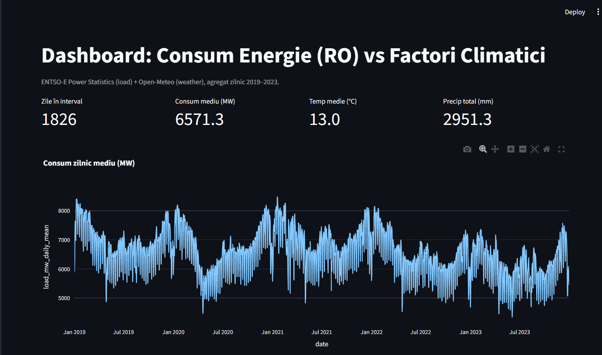
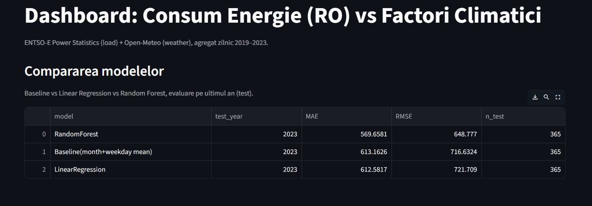

# Modelarea și Predicția Consumului de Energie Electrică în Funcție de Factorii Climatici (România)



Acest proiect analizează variația consumului de energie electrică (România) în funcție de condițiile meteo și construiește modele de predicție pe date istorice. Pipeline-ul este offline (fără real-time), iar rezultatele sunt prezentate într-un dashboard interactiv (Streamlit).

## Rezultate (pe setul 2019–2023, București + RO)

### 1) Dimensiunea datelor și statistici generale
* **Zile totale analizate:** 1826 (2019–2023)
* **Consum mediu zilnic (MW):** 6571.3
* **Temperatura medie (°C):** 13.0
* **Precipitații totale (mm):** 2951.3


### 2) Observații EDA (Exploratory Data Analysis)
* Se observă o **sezonalitate clară** atât în consum, cât și în temperatură (pattern anual repetitiv).
* Relația **temperatură – consum** nu este strict liniară: graficul scatter arată un comportament de tip „U”/curbă (consum mai mare la extreme termice, mai mic la temperaturi moderate), sugerând efecte de încălzire/răcire.
* Matricea de corelații indică:
  * corelații negative între consum și temperaturile (mean/min/max),
  * corelații mai slabe cu precipitațiile și vântul (dependente de sezon și context).
 

### 3) Detecție anomalii (baseline sezonier + z-score robust)
* Am folosit un **baseline sezonier** definit ca media pe combinația **(month, weekday)**.

* Anomaliile sunt zile cu abateri mari față de baseline, detectate pe **reziduuri** (consum − baseline) și scor robust.
* La pragul **|z| = 3.5**, au fost detectate **11 anomalii** (vizibile în pagina „Anomalii” din dashboard), care pot corespunde:
  * sărbătorilor/vacanțelor (schimbări de activitate economică),
  * evenimentelor excepționale sau condițiilor meteo atipice,
  * variațiilor operaționale (de ex. patternuri industriale).
 

### 4) Compararea modelelor (evaluare pe ultimul an = 2023)
Evaluarea s-a făcut pe **test year = 2023**, antrenând pe **2019–2022**. Metricile principale sunt **MAE** și **RMSE** (mai mic = mai bun).

| Model | Test year | MAE | RMSE | n_test |
|------|----------:|----:|-----:|------:|
| RandomForest | 2023 | 569.6581 | 648.7770 | 365 |
| Baseline (month+weekday mean) | 2023 | 613.1626 | 716.6324 | 365 |
| LinearRegression | 2023 | 612.5817 | 721.7090 | 365 |


**Concluzie:** RandomForest are cea mai bună performanță (cel mai mic RMSE și MAE), depășind atât baseline-ul sezonier, cât și regresia liniară.

### 5) Interpretare (din dashboard)
* Modelul RandomForest surprinde mai bine **non-linearități** și **interacțiuni** dintre variabile (meteo + calendar).
* Baseline-ul (month+weekday) este un reper solid, dar nu modelează explicit vremea; performanța mai bună a RF arată că **variabilele climatice aduc semnal util** peste sezonalitate.

---

## Date utilizate


1. **ENTSO-E Power Statistics (offline CSV)**


  * Consum orar (Load) pe țară, filtrat pentru România (RO)

  * Perioadă: 2019–2023 (inclusiv)


2. **Open-Meteo Historical Weather API**


  * Date orare: temperatură, precipitații, vânt, umiditate relativă

  * Localizare: România

  * Agregare zilnică pentru integrare cu consumul


## Obiective


* Identificarea relațiilor dintre consum și vreme:


 * sezonalitate (vară vs iarnă)

 * variații pe zi a săptămânii (weekday/weekend)

 * relația temperatură–consum

 * influența precipitațiilor/vântului

 * detectarea anomaliilor (abateri față de comportamentul așteptat)

  Modelarea consumului pe baza variabilelor climatice și a factorilor de calendar:


 * regresie liniară

 * random forest

 * baseline sezonier (month + weekday)


## Structura proiectului


```

energy-weather-bd/

├─ data/

│  ├─ raw/

│  │  ├─ entsoe/                 # CSV-uri ENTSO-E (offline)

│  │  └─ openmeteo/              # date brute meteo (parquet/json)

│  ├─ processed/                 # entsoe RO orar (parquet)

│  └─ final/                     # dataset zilnic integrat (parquet/csv)

├─ models/                       # modele salvate (joblib)

├─ results/                      # metrici modele (CSV)

└─ src/

  ├─ 01\_ingest\_entsoe\_powerstats.py

  ├─ 02\_fetch\_openmeteo.py

  ├─ 03\_build\_daily\_dataset.py

  ├─ 04\_model.py

  ├─ 05\_nan\_report.py

  ├─ 07\_train\_and\_save.py

  ├─ 08\_model\_comparison.py

  └─ dashboard.py

```


## Cerințe


* Windows + PowerShell

* Python 3.10+ recomandat

* Dependențe: `pandas`, `numpy`, `scikit-learn`, `streamlit`, `plotly`, `joblib`


## Instalare


1. Creează și activează un virtual environment:


```powershell

python -m venv .venv

.venv\\Scripts\\Activate.ps1

```


2. Instalează dependențele:


```powershell

pip install -r requirements.txt

```


Dacă nu ai `requirements.txt`, instalează rapid:


```powershell

pip install pandas numpy scikit-learn streamlit plotly joblib -q

```


## Pregătirea datelor (ENTSO-E offline)


Pune fișierele ENTSO-E în:


```

data/raw/entsoe/

```


Exemplu nume fișiere:


* `monthly\_hourly\_load\_values\_2019.csv`

* `monthly\_hourly\_load\_values\_2020.csv`

* `monthly\_hourly\_load\_values\_2021.csv`

* `monthly\_hourly\_load\_values\_2022.csv`

* `monthly\_hourly\_load\_values\_2023.csv`


Notă: unele fișiere pot avea separator `\\t` sau `;`. Scriptul de ingestie detectează automat separatorul.


## Rulare pipeline (end-to-end)


Din rădăcina repo-ului:


```powershell

python src\\01\_ingest\_entsoe\_powerstats.py

python src\\02\_fetch\_openmeteo.py

python src\\03\_build\_daily\_dataset.py

python src\\04\_model.py

python src\\08\_model\_comparison.py

```


Verificare integritate (fără NaN în target):


```powershell

python src\\05\_nan\_report.py

```


## Antrenare și salvare model (pentru dashboard)


```powershell

mkdir models -Force

python src\\07\_train\_and\_save.py

```


## Dashboard (Streamlit)


```powershell

streamlit run src\\dashboard.py

```


Dashboard-ul include:


* **Overview**: trend consum, temperatură, precipitații

* **EDA**: scatter + trendline, corelații, sezonalitate

* **Anomalii**: reziduuri față de baseline (month+weekday) + z-score robust + tabel

* **Predicții**: Real vs Predicție (RF), MAE/RMSE, simulare “temperature shift”

* **Model Comparison**: baseline vs LR vs RF (MAE/RMSE) din `results/model\_metrics.csv`


## Metodologie (pe scurt)


1. Ingest ENTSO-E offline + filtrare RO

2. Descărcare meteo (București) via Open-Meteo

3. Agregare zilnică și integrare pe axa temporală

4. Analiză exploratorie (trend, sezonalitate, corelații)

5. Modelare:


  * Baseline sezonier (month+weekday)

  * Linear Regression

  * Random Forest

6. Evaluare pe ultimul an (test) + interpretare (feature importances)


## Reproducibilitate


* Proiectul rulează offline după ce datele ENTSO-E sunt puse în `data/raw/entsoe/`.

* `data/` poate fi exclus din Git (recomandat prin `.gitignore`), iar pipeline-ul poate fi refăcut pe alt sistem.


## Licență


Datele rămân sub licențele furnizorilor (ENTSO-E / Open-Meteo). Codul poate fi licențiat separat (ex. MIT) dacă este necesar.


